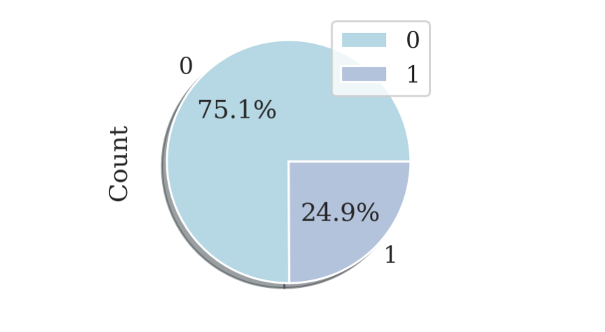

# Data Scientist Job Change (MVP)
## Goal :
- The primary goal of the project is to predict either they will look for a new job or not.
## Training workflow:
- EDA, to find anomalies in the data such as nulls
- Feature engineering to enhance the model
The following models are used:
- Logistic regression (Baseline)
- Random forest
- XGboost
- KNN
- Decision Tree
## Findings

The above figure shows that our target variable is imbalanced

